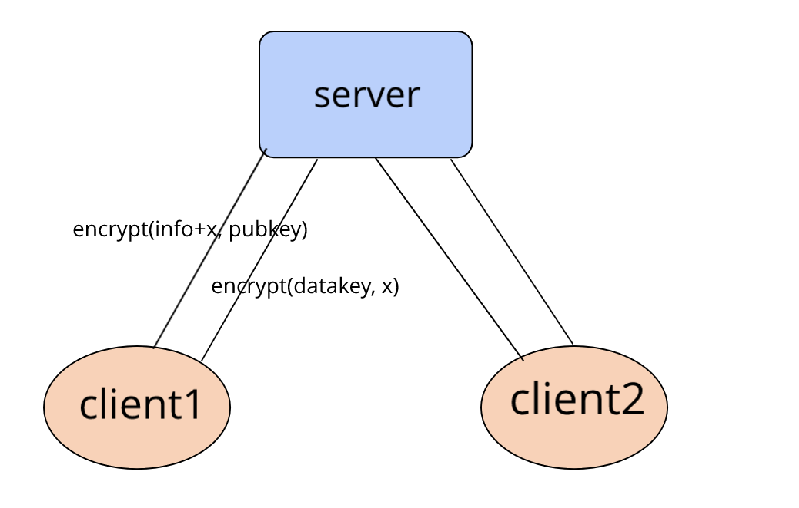

# Hideme
A tool helps to encrypt plain message in http based on RSA public key.
A public key will be store in client side, when encryption is needed, 
the client sdk would use the pub-key to encrypt initial infos and send
 it to server. Server use the received info to calculate a data key, which
  will be used to encrypt sensitive data during transmission.
# Architecture

`encrypt(info+x, pubkey): encrypt info&x with pubkey.` 
`x: a random string generated in client, server will encrypt datakey with x and return to client.`

